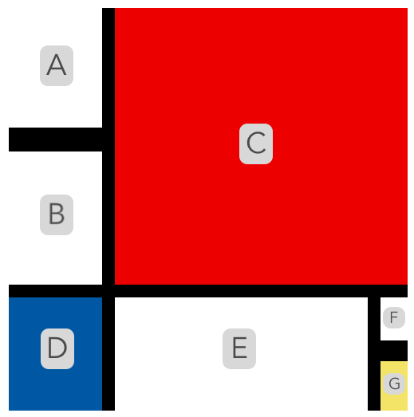

# Recreate a painting using Bootstrap's grid

In this project you will practice using the fundamentals of Bootstrap grid by piecing together a famous painting, namely Piet Mondrian’s Composition II in Red, Blue, and Yellow:

## Instructions

In <b>index.html</b> is a container with columns that represent various pieces in _Composition II_. You can tell which piece is what by the element’s id and the comment inside the column and with the labeled painting below:

The column’s height and colors, and the container’s height and width, are already included in <b>style.css</b>. Your goal is to recreate the painting by:

- using the existing container.
- unscrambling the order of the provided columns.
- adjusting the widths of the provided columns.
- adding new rows and additional columns.
- nesting row(s) inside columns.